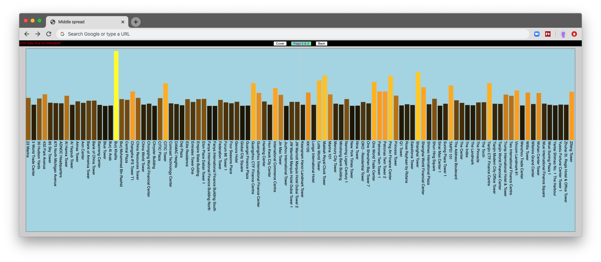
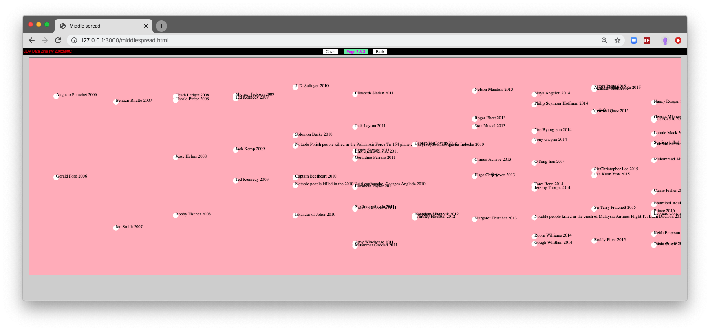

## Lab 4 - D3 Scales

#### today's agenda
- intro to scales (with pictures) [slides](https://docs.google.com/presentation/d/1pR2IW1NSbJ2CCS9skxT5hek4d_5EYeJVX7le5yedlsU/edit?usp=sharing)
- live coding demo: high buildings ([starting_files](lab4-linear-scale_blank.zip))
- live coding demo: dead celebrities ([starting_files](lab4-time-scale_blank.zip))

### live coding demo: high buildings
- [Exercise Files](lab4-linear-scale.zip)
- [Video 1](https://drive.google.com/file/d/1FsWXKaYx7hIgorfcPudtK_DPQkSs44o8/view?usp=sharing)
- [Video 2](https://drive.google.com/file/d/19TpfYK3NThC756hMLAoGvU_VeORqXg8H/view?usp=sharing)

(two videos, because my computer ran out of battery)

### live coding demo: dead celebrities
- [Exercise Files](lab4-time-scale.zip)
- [Video 3](https://drive.google.com/file/d/1rpgu6S7-pEacLTbczigxoEj6QHVzoU82/view?usp=sharing)

[a commented code](lab4-time-scale-commmented/js/middlescript.js)
