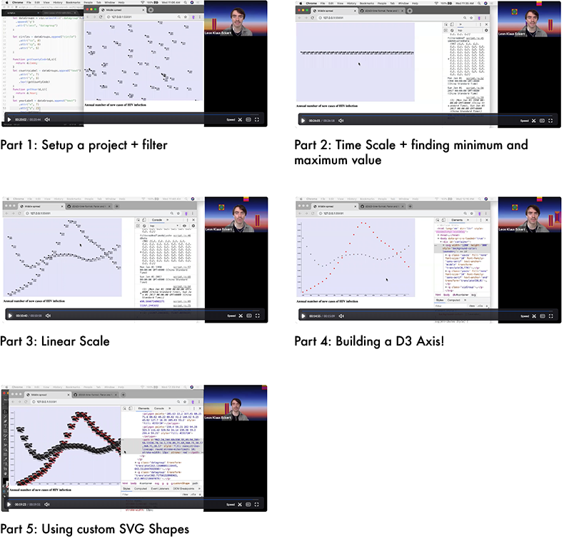

## Lab 5 - Review + Axis & Custom SVG Shapes

#### today's agenda
- check out [WIP](https://github.com/leoneckert/critical-data-and-visualization-spring-2022/wiki/)
- Live Coding / Videos / Questions 

### Review and New Learnings
- [Download Exercise Files](hiv-graph-start.zip)
<!-- - Edit: [commented finished version of the code](finished-hiv-graph/script.js) -->

##### Videos

- Part 1: Setup a project + filter ([video](https://drive.google.com/file/d/1x5iNAO1L-e_0JiyWvk39OnyZe7ApKQy3/view?usp=sharing) 20:44)
- Part 2: Time Scale + finding minimum and maximum value ([video](https://drive.google.com/file/d/1sh_EHliiQd7x_Sn0MEiTVza8mXI0IT6R/view?usp=sharing) 26:18)
- Part 3: Linear Scale ([video](https://drive.google.com/file/d/1dvTiL-n2A3IXEAyn24ddYXx8l8WEm05C/view?usp=sharing) 10:58)
- Part 4: Building a D3 Axis! ([video](https://drive.google.com/file/d/19lxv883oqcz_2aghuJHnqqmt32x4oCCm/view?usp=sharing) 15:09)
- Part 5: Using custom SVG Shapes ([video](https://drive.google.com/file/d/1izyMF5joctQL5X-gX2Wok_2XyF-A7MFD/view?usp=sharing) 19:51)

