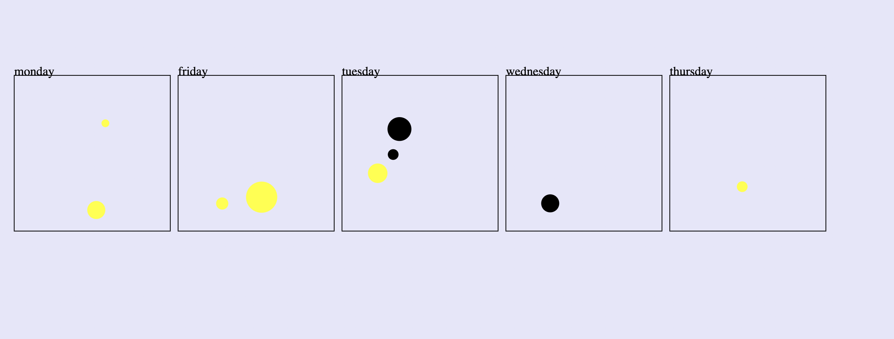

# nested data: grouping data and binding nested data to elements
example code that demonstrates how data can be transformed so that its structure can be better used to create the visual we have in mind. 

this code uses d3.group to group data by one of the datapoints' features.

it also demonstated how such grouped that can by bound to elements in a nested fashion. 

Code is above ☝️ 

Live Version is [here](https://leoneckert.github.io/critical-data-and-visualization-spring-2022/labs/nestedData-example/middlespread.html)

This is how the final outcome looks:

