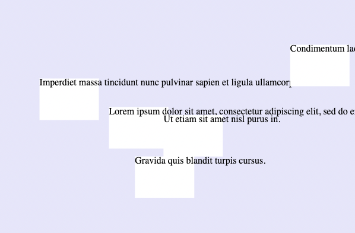
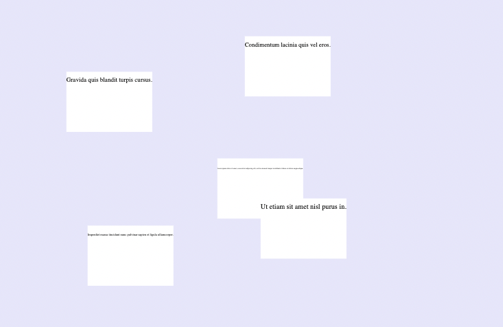

# Wrapping Text 

### Description of the Problem:

To append text to an SVG shape in d3, we use code like this:
```js
let texts = datagroups.append("text")
            .text(function(d, i){
                return d.text;
            })
            .attr("x", 0)
            .attr("y", 12)
;
```
Doing this, the text is rendered as SVG elements that behave slightly different to "smart" html text that wraps into new lines. As a result, you may end up with visual issues like this at times:


### Solutions that are out there:

Google results on how to "wrap text D3" may deliver complex results like this `wrap` function in this [example](https://bl.ocks.org/mbostock/7555321) by Mike Bostock. 

Making this easier is a library I have found on GitHub, it's [d3-textwrap](https://github.com/vijithassar/d3-textwrap) by the user [vijithassar](https://github.com/vijithassar). This library offers two solutions to the problem: (1) it provides a simple method to turn the text into HTML elements inside our SVG element (a task slightly less trivial than it sounds because usual html element are not suppported inside the SVG tag). and (2) another method to chop the sentence in pieces of the right length, wrapping those pieces in tspan tags and positioning those to appear line by line. 


## Solution for this course:

### Download Mini Library
To make all these even easier for students of this class, I have further simplified this library. You may download the [cdvTextWrap.js](cdvTextWrap.js.zip) file and include it into your project folder like you would with another library. 

### How to use it
Then include it into your project like so:
```html
<script src="https://d3js.org/d3.v7.min.js"></script>
<script src="cdvTextWrap.js"></script>
```
and use it on any text in your d3 code like this:
```js
let texts = datagroups.append("text")
            .text(function(d, i){
                return d.text;
            })
            .attr("y", 12)
            .call(cdvTextWrap(300))
;
```
where `300` is the width of the box the text should be wrapping into. Note: we do not define any height here since the text will just take as much height as it needs given the width. 


### Full Example
Find a full example in the same folder as this README file. ([here](example/script.js) is the example's js code)


---
### Also of Interest
In other scenarios you might be looking for a way to resize the text size based on the available, horizontal space, like this:


There are multiple approaches to be found when googling "d3 fit text into box", for example [this one](https://javascript.tutorialink.com/d3-js-auto-font-sizing-based-on-nodes-individual-radius-diameter/).